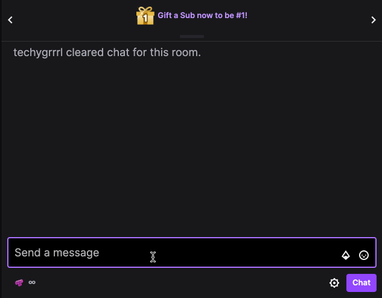

# TE:C SR cloud function

A Cloudflare Worker serverless function that gets my leaderboard stats from Quarter Zone and outputs it as a string.

This is used for chatbots powered by StreamElements.




- [Usage](#usage)
  - [Cloudflare Worker setup](#cloudflare-worker-setup)
  - [StreamElements setup](#streamelements-setup)

## Usage

### Cloudflare Worker setup

- Create a Cloudflare Worker function
- Click "Quick Edit" to edit the function code
- Paste the contents of `function.js`, replacing the `profileUrl` with your own
- Edit the `message` to change my username to yours
- Save and deploy the function


### StreamElements setup

- Create a new custom command `!sr` 
- Configure the User Level—I've left it to Everyone
- In the Response field, paste the following, replacing the values `APP_NAME` and `YOUR_USERNAME` in the worker URL as needed. This would be the URL of your newly-created Cloudflare Worker.

```text
$(customapi.https://APP_NAME.YOUR_USERNAME.workers.dev?sender=$(sender)&query=$(queryencode $(1:)|null))
```